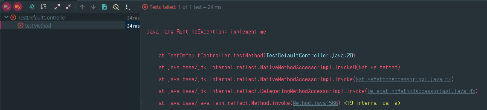
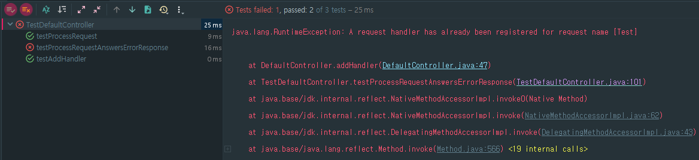
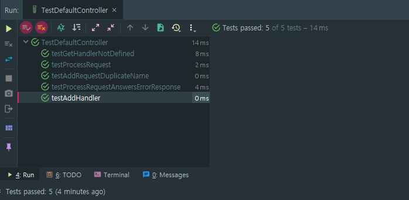

step01을 실행시키면 아래와 같이 실패한다.



step02에서는 addHandler와 processRequest를 테스트한다.

step03
step02에서 두가지 테스트를 진행함에 있어 기본적인 세팅(객체를 생성하고, 컨트롤러에 핸들러를 추가하는)을 하는 부분이
반복되게 되는데 이부분을 step03에서는 @Before 메서드로 옮긴다.

이때 주의해야할 점,
코드 공유를 하겠다고 하나의 테스트 메서드 안에 두개 이상의 테스트를 수행하는 것은 삼가자.
```java
잘못된 예 : 테스트 메서드는 합치지 말자.

@Test
public void testAddAndProcess() {
  Request request = new SampleRequest();
  RequestHandler handler = new SampleHandler();
  controller.addHandler(request,handler);
  RequestHandler handler2 = controller.getHandler(request);
  assertEquals(handler2, handler);

  // 테스트 함수를 이런 식으로 혼합하지 말 것!
  Response response = controller.processRequest(request);
  assertNotNull("Must not return a null response", response);
  assertEquals(SampleResponse.class, response.getClass());
}
```
정해진 상태(객체 생성, 자원 획득)로 테스트 환경을 초기화한다.
테스트 이전의 상태는 ``테스트 픽스쳐(test fixture)``라 한다.

하나의 @Test 메서드에서는 하나의 테스트만 수행하라.
최악의 케이스는 '테스트를 테스트'하는 테스트 코드를 작성하는 상황이다.

한 메서드에서 두 개 이상의 단위 테스트를 수행한다면, 문제의 원인을 정확히 짚어내기가 그만큼 어려워진다.
여러 테스트가 한 메서드에서 실행되면, 실패한 테스트가 픽스쳐를 예상치 못한 상태로 남겨 놓기도 한다.
그렇게 되면 뒤이은 테스트들은 실행되지 않거나, 잘못된 방식으로 실행될 수 있다.
결국 테스트 결과는 불완전하거나 심지어 전혀 엉뚱한 데이터일 가능성이 생긴다.

같은 테스트 클래스 안의 모든 테스트 메서드는 같은 픽스쳐를 공유하고, JUnit이 테스트 스위트까지
알아서 만들어주기 때문에 단위테스트당 하나의 메서드를 할당하는 것은 쉽다.
같은 코드 블록을 두 개 이상의 테스트가 사용해야 한다면, 유틸리티 메서드로 뽑아내어 필요한 테스트 메서드에서
호출하도록 한다. 모든 메서드가 공유하는 코드라면, 픽스쳐에 집어넣는 것이 더 좋은 선택이다.

테스트 메서드 안에서 assert문을 전혀 사용하지 않는 것도 우리가 많이 저지르는 실수이다.
JUnit은 이런 테스트를 무조건 성공한 것으로 표시하므로 항상 assert문을 호출하도록 해야 한다.
assert문을 사용하지 않아도 좋은 유일한 경우는 예외를 던져 오류를 알리는 때뿐이다.

JUnit이 ``@Before, @After, @BeforeClass, @AfterClass``어노테이션을 제공하는 이유가
바로 테스트 메서드를 합치지 않고도 테스트 사이에서 **픽스쳐를 공유**할 수 있도록 하기 위함이다.

[processRequest 개선]
목표 : 반환된 응답이 예상 응답과 동등한가(equal)

두 객체(반환된 응답과 예상 응답)가 신원(identity)이 같은지 확인하려면, 신원을 증명할 고유한 수단을 제공해야한다.
응답 객체의 경우 각 응답에 고유한 토큰(혹은 이름)을 할당하는 방법이 가능하다

assertSame메서드는 두 참조(reference)가 같은 객체를 가리키는가를 검사한다.
반면 assertEquals메서드는 Object클래스로부터 물려받은 equals를 사용해 객체를 비교한다.

SampleResponse가 검사할 수 있는 이름 속성을 가지도록 구현하였다.


!! 테스트는 애플리케이션을 더 나은 설계로 이끌어주는 가이드 역할을 하지만 이게 테스트 본연의 목적은 아님!
테스트는 코드에서 **에러가 발생하는 것**으로부터 우리를 **보호**할 목적으로 사용됨.

step04


데이터베이스 API를 올바로 활용하고 있는지 검사한다.
만약 connection을 열기만 하고 닫지 않는다면, 모든 컬렉션은 사용 후 닫혀야 한다는 조건을 만족시키지 못했다고
알려줄 것이다.

그런데 가용한 connection이 없다면?
예를 들면, connection pool이 고갈되었을 수도 있고, 데이터베이스 서버가 다운되었을 수도 있다.

데이터베이스 서버가 제대로 설정되어 있고, 필요한 모든 자원이 갖춰져 있다면 절대 일어나지 않을 상황이지만
모든 자원은 한계가 있고, 언젠가는 connection대신 예외를 건네받게 된다.

수동으로 테스트하는 경우, 애플리케이션 실행 도중에 데이터베이스를 종료시켜서 이런 상황을 테스트할 수 있다.
오류 상황을 강제로 만들어내는 것은 장애 복구 능력 검증을 위한 훌륭한 방법이다.
하지만 임의로 오류 상황을 만드는 데에는 굉장히 많은 시간이 소요된다. 일반적으로 하루에 몇 번 정도밖에
테스트하지 못할 것이다. 더구나 수동으로는 쉽게 만들어낼 수 없는 오류도 수없이 많다.

주 실행 경로 테스트는 물론 좋은 것이고, 기본적인 요구사항임.
하지만 예외 처리 테스트도 못지않게 중요하고, 역시 요구사항에 포함시켜 다뤄야한다.
주 실행 경로가 동작하지 않는다면, 여러분의 애플리케이션도 동작하지 않을 것이다.
(꼭 알고 있어야 하는 상황이다.)

실패할 가능성이 있는 모든 것을 테스트하라.

단위테스트는 당신의 메서드가 다른 메서드들과의 API계약을 잘 지키고 있음을 보장하는데 도움을 준다.
그 계약이 오로지 연관된 다른 컴포넌트가 각자의 계약을 잘 준수하는지에만 종속된다면, 테스트할 것이 별로 없을지도 모른다. 하지만 **메서드가 어떤 방식으로건 파라미터나 필드의 값을 수정한다면, 테스트가 필요한 고유 기능이 존재한다는 의미** 이다. 향후 코드를 수정하면 오동작할 가능성이 있는 기능을 가지므로, 더 이상 단순 매개자로 볼 수 없다.
또한 단순했던 메서드도 수정이 가해지면서 복잡해졌다면, 수정 시에 테스트도 함께 추가해야한다.

단위테스트는 예외 상황을 원하는 시점에 바로 만들어낼 수 있다.
이전 step에서 기반 클래스에 오류 핸들러를 추가할 수 있도록 구현했었다.
processRequest메서드는 모든 예외를 잡아 ErrorResponse라는 특수한 응답 객체를 대신 반환한다.
```java
try{
    response=getHandler(request).process(request);
}catch(Exception exception){
    response = new ErrorResponse(request, exception);
}
```
이전에는 정상적인 요청처리를 테스트하기 위해 SampleRequest를 반환하는 SampleRequestHandler를 하나
생성해주었다면, step04에서는 오류 상황을 테스트하기 위해 예외를 발생시키는 핸들러를 대신 사용했다.

실행시키면 아래와 같이 실패한다.

addHandler를 통해 handler를 request와 함께 등록하려는 부분에서 오류가 발생한 것을 알 수 있다.
이는 해당 테스트 메서드에서 새로 생성한 SampleRequest객체와 앞서 @Before 어노테이션을
부여한 initiate메서드 내에서 생성한 SampleRequest의 신원(identity)가 동일해서 발생한 오류다.
SampleRequest는 현재 'Test'라는 이름으로만 생성되도록 구현되어 있다.

테스트를 성공시키기 위해
SampleRequest가 매번 다른 이름으로 생성될수 있도록 수정하였다.



step05
확장성이라는 애플리케이션의 또다른 측면을 테스트해보자.
DefaultController의 확장성을 알아본다.

주어진 제한시간 내에 동작을 완료할 수 있는지 검사하는 테스트를 작성한다.
JUnit의 @Test애노테이션은 timeout이라는 이름의 또 다른 파라미터를 제공한다.
이 파라미터를 이용해 밀리초 단위로 제한시간을 설정할 수 있다.
JUnit은 주어진 시간 내에 완료되지 못한 테스트는 실패라고 판단한다.
