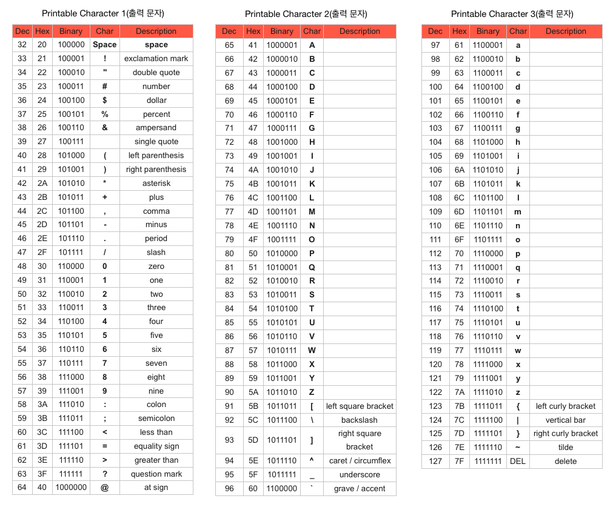

# 출력 스트림
서버의 전송계층은 인접하고 연속적인 datagram을 수신하면,
datagram을 재조립하여 서버의 애플리케이션 계층에서 실행중인 웹 서버에서 읽을 스트림(stream)에 쓴다.
```java
OutputStream

BufferedOutputStream
ByteArrayOutputStream
DataOutputStream
FileOutputStream
FilterOutputStream
ObjectOutputStream
PipedOutputStream
```
OutputStream의 기반 메서드
------------
0에서 255까지의 정수를 인자로 받고 이에 대응하는 바이트를 출력 스트림에 쓴다.
서브 클래스에서 목적에 맞는 특정 매체를 다루기 위해 변경할 수 있도록
추상 메서드(abstract method)로 선언되어 있다.
```java
public abstract void write(int b) throws IOException;
```

* ByteArrayOutputStream
확장 바이트 배열(expandable byte array)에 쓰기 위해 이 메서드를 사용함.

  ```java
  // 바이트를 배열로 복사하도록 재구현.
  public synchronized void write(int b) {
      ensureCapacity(count + 1);
      buf[count] = (byte) b;
      count += 1;
  }
  ```

* FileOutputStream
파일에 쓰기 위해 이 메서드를 사용함.
  ```java
  // 파일에 데이터를 쓰도록 재구현.
  public void write(int b) throws IOException {
      write(b, fdAccess.getAppend(fd));
  }
  ```

한 번에 한 바이트씩 출력하는 방식은 매우 비효율적이다.
네트워크로 쓸 경우, 네트워크로 전송되는 모든 TCP 세그먼트는 라우팅과 오류 정정을 위해
최소 40바이트 이상의 추가적인 데이터를 포함하고 있다.
각 바이트를 개별로 전송하면 실제로 보내야 하는 데이터의 크기보다 41배나 많은 데이터가 네트워크로 전송된다.
여기에 호스트-투-네트워크 계층 프로토콜의 부담까지 추가되면 실제 전송 데이터는 훨씬 커진다.
이러한 문제를 해결하기 위해 대부분의 TCP/IP구현은 어느 정도의 데이터를 버퍼링하여 전송한다.
즉, TCP/IP는 메모리에 데이터를 쌓아두고, `일정 수치에 도달`하거나 `특정 시간을 초과`할 경우 데이터를 전송한다.

```java
// 아래와 같은 메서드를 사용하여 한 번에 전송하는 것이 1바이트씩 반복해서 보내는 것보다 일반적으로 훨씬 빠르다.
public void write(byte b[]) throws IOException {
    write(b, 0, b.length);
}

public void write(byte b[], int off, int len) throws IOException {
    Objects.checkFromIndexSize(off, len, b.length);
    // len == 0 condition implicitly handled by loop bounds
    for (int i = 0 ; i < len ; i++) {
        write(b[off + i]);
    }
}
```

flush() 메서드는 버퍼가 아직 가득 차지 않은 상황에서 강제로 버퍼의 내용을 전송함으로써 데드락(deadlock)상태를 해제한다.
```java
public interface Flushable {
    void flush() throws IOException;
}
```

```java
public abstract class OutputStream implements Closeable, Flushable {
    public void flush() throws IOException {
    }
}
```
```java
public class FileOutputStream extends OutputStream {
  // flush 관련된 코드가 없음!
}
```
당연함!

일반적으로 스트림 아래에 BufferedOutputStream이나 BufferedWritier를 연결하여 버퍼링이 가능해진다.
이러한 버퍼링이 사용되기 때문에 출력 스트림을 사용할 때 플러시(flush)가 중요하다.

버퍼링 기능이 없는 FileOutputStream에는 구현되어 있지 않은게 당연!

```java
public class BufferedOutputStream extends FilterOutputStream {
    protected byte buf[];

    private void flushBuffer() throws IOException {
        if (count > 0) {
            out.write(buf, 0, count);
            count = 0;
        }
    }

    @Override
    public synchronized void flush() throws IOException {
        flushBuffer();
        out.flush();
    }
}
```
```java
public class FilterOutputStream extends OutputStream {
    protected OutputStream out;

    @Override
    public void flush() throws IOException {
        out.flush();
    }
}
```

스트림이 버퍼링되는지를 판단하여 플러시하는 것봐 항상 플러시를 하는 것이 좋다.
특정 스트림의 참조를 획득하는 방법에 따라 해당 스트림의 버퍼링 여부를 판단하기 어려운 상황도 발생하기 때문이다.
(예를 들어, System.out 은 의도와 상관없이 버퍼링을 한다.)
플러시가 필요없는 스트림에 붎필요한 플러시가 발생할 수도 있지만, 이때 발생하는 시스템 부하는 무시해도 되는 수준이다

오히려 플러시가 꼭 필요한 상황에서 플러시 호출에 실패하면 상황은 더 나빠진다.
플러시 실패때문에 예측 불가능하고 재현이 어려운 프로그램의 종료 상황이 발생할 수 있으며, 문제의 원인이 바로 눈에 보이지 않는다면
진단하기가 매우 어렵다.

그리고 다 쓴 스트림은 닫기 전에 항상 플러시해야 하며, 그렇지 않을 경우 스트림이 닫힐 때 버퍼 안에 남아있는 데이터가 손실될 수 있다.

# 문자발생기 예제

